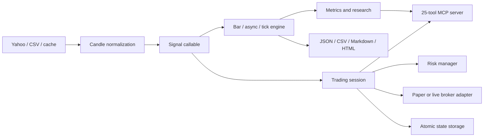

# Architecture

TradeLab keeps market-data acquisition, strategy intent, execution simulation, analytics,
and broker I/O separate. The same strategy callable can therefore move from research to a
paper session without embedding transport or persistence concerns.

## Design invariants

- Inputs are validated at public boundaries and numerical state must remain finite.
- Backtest outputs are immutable, defensive, and strict-JSON serializable.
- Simulations are deterministic unless a seed-controlled probabilistic model is requested.
- Cache, report, research, and live-state writes use atomic replacement.
- User-provided namespaces and filenames cannot escape their configured root.
- Live execution is impossible without an environment gate, explicit confirmation, and a
  credentialed broker.
- HTTP clients, clocks, sleepers, and external stores are injectable for deterministic tests.

## Package layout

| Package | Responsibility |
| --- | --- |
| `tradelab.data` | CSV/Yahoo ingestion, normalization, merge/statistics, atomic caches |
| `tradelab.ta` | Array-aligned indicators |
| `tradelab.engine` | Bar, async, tick, portfolio, grid, optimization, walk-forward |
| `tradelab.metrics` | Performance, benchmark, and annualization statistics |
| `tradelab.research` | Monte Carlo, DSR, PBO, CPCV, persistent research logs |
| `tradelab.strategies` | Built-ins and a thread-safe registry |
| `tradelab.reporting` | Strict JSON, CSV, Markdown, and offline HTML artifacts |
| `tradelab.live` | Events, risk, paper execution, sessions, storage, orchestration |
| `tradelab.brokers` | Alpaca, Binance, Coinbase, and optional Interactive Brokers |
| `tradelab.mcp` | Agent-facing research and session tools over stdio |

## JavaScript parity

The source TradeLab 1.3.1 repository is treated as an immutable oracle. Fixture generators
run the JavaScript implementation and the Python parity suite compares canonical results.
Python intentionally corrects defects where parity would compromise safety, including true
New York daily boundaries, strict non-finite rejection, path traversal containment, and
cross-loop request throttling.
